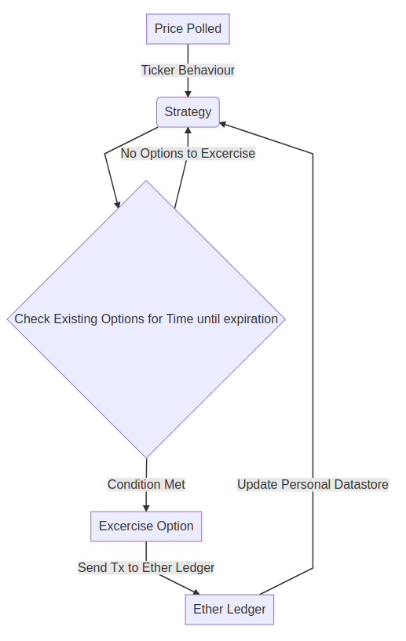

#  Strategy

Strategy is defined  within the /autonomous_hegician/option_monitoring/strategy.py

The initial strategy we have implemented is designed to monitor options and to execute them if they are:

 - A) in the money.
 - B) within 5 minutes of execution.

# Behaviours
We have implemented 4 behaviours.

 - Price Ticker behaviour.
This behaviour polls uniswap for the DAI ETH price and updates an internal state of the price.
 - Contract Deployment behaviour.
 This behaviour handles the intial setup of the contracts when the agent is deployed on a local tet net. It also handles deploying the Contract Api messages to the Ledger.
- Snapshot Behaviour.
This behaviour uses the price from the Price Ticker behaviour, and the current balance of the agent to take a snap of the total value of the agent.
The snapshots are used to contract the equity charts from the front end.
 - Option Management behaviour.
 This behaviour handles interactions with options contracts. 
 Using orders retrieved from the strategy class the agent will decide which orders to;
 - Create - The agent reads the order parameters from the local Postgres Database. Once orders are retrieved from the database, the agent will call the estimate function on the appropriate smart contract and 
 - Exercised - The agent 
  - Expire - Once orders have passed their expiration date, the status code on the order is changed to EXPIRED

 

# Front End
The front end for user interaction is built on on react.
The user has the ability to cerate new options contracts from the from end, which the agent will then monitor for execution.
We use http request to communicate with the database. 
Our agent will then read the pending tx from this datastore.
NOTE, this means that any options contracts which have not been added to the datastore will not be monitored!

# Architecture

(/schema/Architecture.jpg)
Format: 

# Architecture schema

